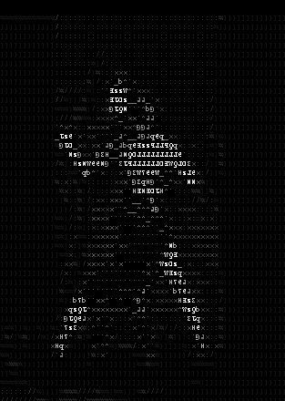

  
   
  

 
<!-- -->
 
<h3>Skills</h3>

<!--  -->

  

    
    
    
    
    
  

  
   
   
  
  <h3>Front-End</h3>
  

    
    
    
    
    
    
    
    
    
    
    
    
    
    
    
  

 
 
  
  <h3>Back-End</h3>
  

    
    
    
    
    
    
    
    
  

 
 

 
  
<!--  

 -->
  

  <i>"Melhor professor, o fracasso é."    -Yoda</i>

  

    
  
  
  
  
    
  

  

      
  

 
  
<!--  -->

<picture>
  <source media="(prefers-color-scheme: dark)" srcset="https://raw.githubusercontent.com/gabrielfray/gabrielfray/output/github-contribution-grid-snake-dark.svg">
  
</picture>

